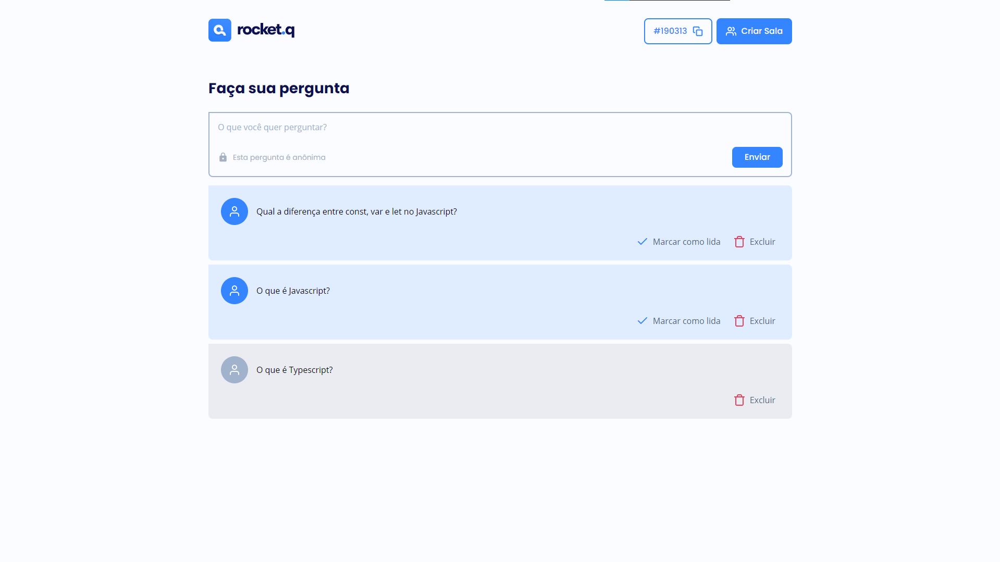

# RocketQ

## Descrição

O RocketQ é um projeto de salas de perguntas. Quando uma sala é criada, um código é gerado, o que permite que os participantes façam perguntas ao criador. Utilizando esse código para encontrar a sala correta.

Qualquer pessoa pode criar estas salas e interagir com outras pessoas, propriamente pelas perguntas realizadas. O criador informa uma senha, para que seja possível marcar as perguntas que já foram lidas e podendo também excluí-las. Somente o criador pode realizar essas alterações.

        
## Ilustração do projeto
 

    <h3>Início</h3>
    

    <h3>Sala</h3>
    

 

Criado por: Luiz Thiago

Supporte: @rocketseat
